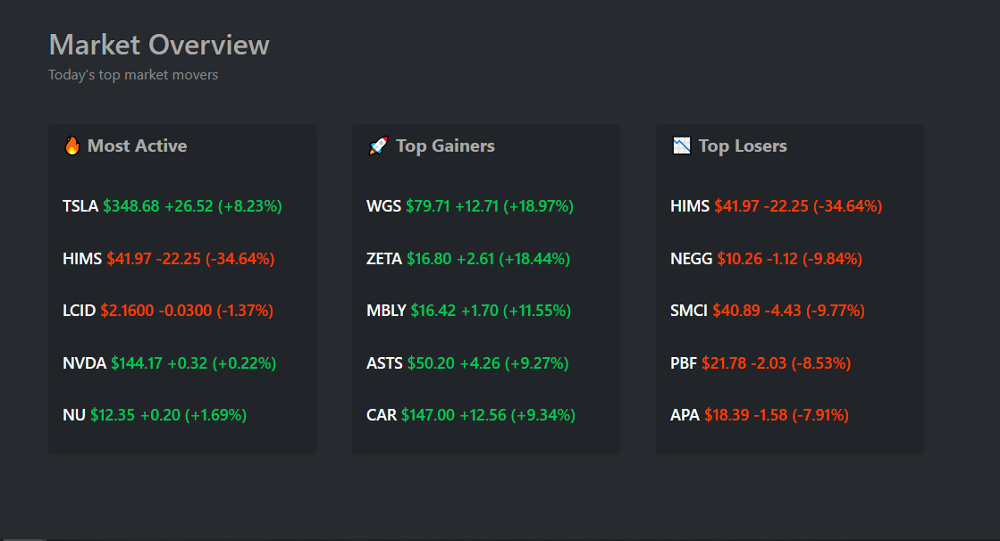
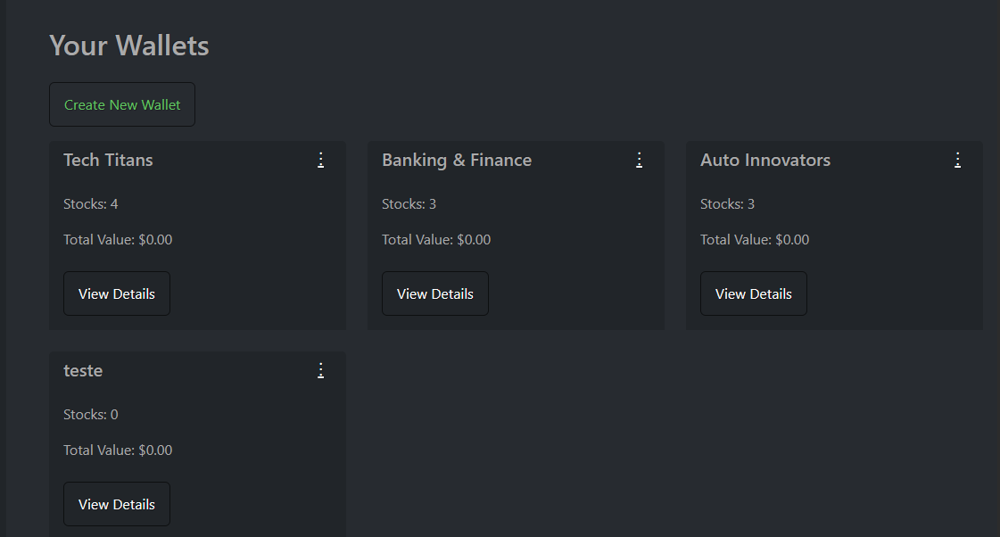
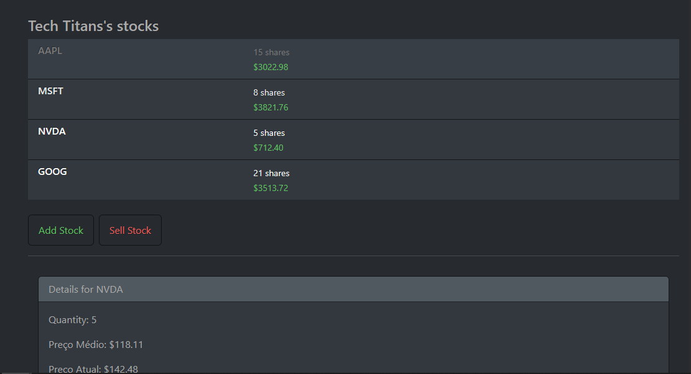
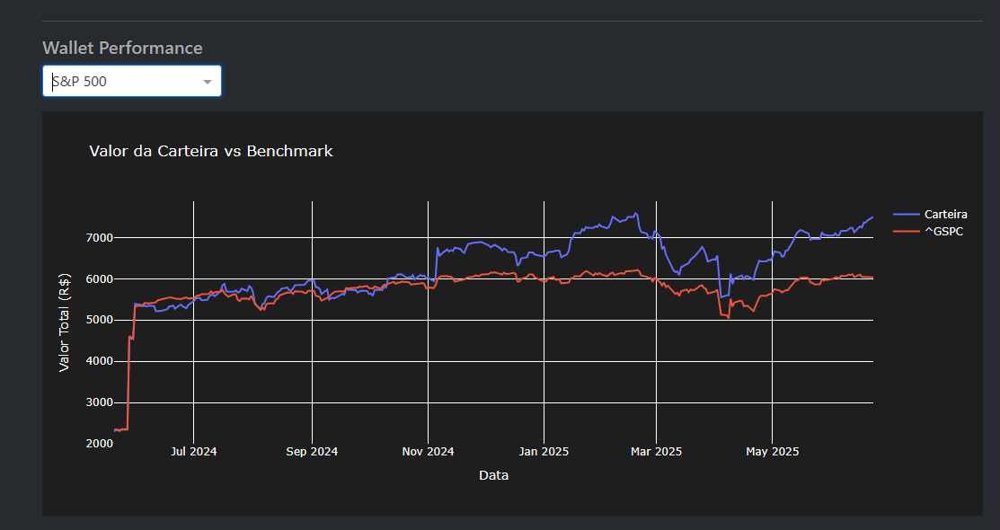

# StockTracker Portfolio Manager


A comprehensive stock portfolio tracking application with performance analytics, benchmark comparisons, and reporting capabilities.

## ✨ Features

- **Portfolio Dashboard**: Track all your investments in one place
- **Performance Analytics**: Compare against major benchmarks (S&P 500, DJI, etc.)
- **Automatic Reporting**: Generate TXT/CSV reports with one click
- **Transaction History**: Detailed record of all purchases/sales
- **Dark Mode**: Eye-friendly interface

## 🖥️ Screenshots

<br>
*Main dashboard showing market movers*

<br>

<br>
*Wallet overview with all your investment portfolios*

<br>

<br>
*Stock listing and data*

<br>

<br>
*Detailed wallet history and performance vs benchmark*

## 🚀 How to Use

### Navigation Sidebar
The left sidebar provides quick access to all features:
- **Home**: Market movers overview
- **Wallets**: Manage multiple investment portfolios

### Basic Workflow
1. **Add a Wallet or Delete a Wallet**  
   Click "Create New Wallet" in the Wallets section to create a new Wallet
   Click "..." menu in the Wallets section to delete a Wallet

3. **Add Stocks**  
   Use the "Add Stock" button to record purchases:
   - Enter ticker symbol (e.g., AAPL)
   - Input purchase price and quantity
   - Add purchase date
   Use the "Sell Stock" button to sell stocks:
   - Enter ticker symbol (e.g., AAPL)
   - Input quantity

4. **Track Performance**  
   View performance in:
   - Portfolio value chart
   - Benchmark comparisons
   - Gain/loss metrics

5. **Generate Reports**  
   Export data via:
   - Download buttons in the stocks section

## 📦 Dependencies

```bash
pip install beautifulsoup4 curl_cffi dash dash-bootstrap-components pandas matplotlib yfinance plotly unittest
```

## 🙏 Acknowledgments
- [yfinance](https://pypi.org/project/yfinance/) for market data
